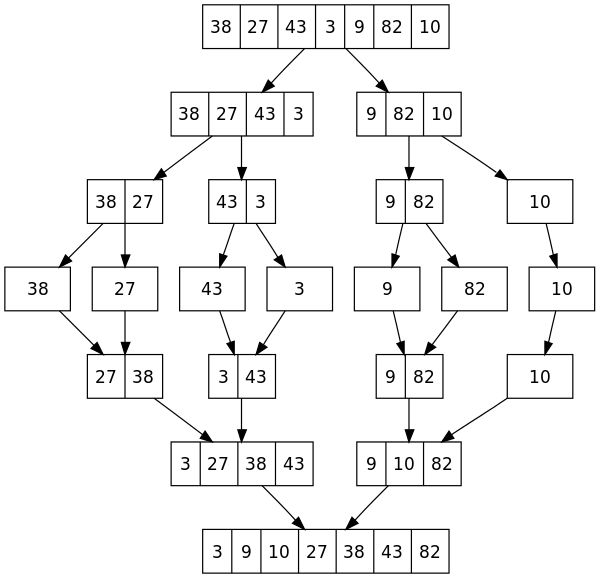

# Merge Sort

### Pseudo Code:

1. If the list is of length 0 or 1, then it is already sorted. Otherwise:
1. Divide the unsorted list into two sublists of about half the size.
1. Sort each sublist recursively by re-applying merge sort.
1. Merge the two sublists back into one sorted list.



```js
function merge(left, right){
    var result  = [],
        il      = 0,
        ir      = 0;

    while (il < left.length && ir < right.length){
        if (left[il] < right[ir]){
            result.push(left[il++]);
        } else {
            result.push(right[ir++]);
        }
    }

    return result.concat(left.slice(il)).concat(right.slice(ir));
}
```

Version that returns a new array:

```js
function mergeSort(items){

    // Terminal case: 0 or 1 item arrays don't need sorting
    if (items.length < 2) {
        return items;
    }

    var middle = Math.floor(items.length / 2),
        left    = items.slice(0, middle),
        right   = items.slice(middle);

    return merge(mergeSort(left), mergeSort(right));
}


In-place version:

```js
function mergeSort(items){

    if (items.length < 2) {
        return items;
    }

    var middle = Math.floor(items.length / 2),
        left    = items.slice(0, middle),
        right   = items.slice(middle),
        params = merge(mergeSort(left), mergeSort(right));

    // Add the arguments to replace everything between 0 and last item in the array
    params.unshift(0, items.length);
    items.splice.apply(items, params);
    return items;
}
```

[Source 1](https://en.wikipedia.org/wiki/Merge_sort)

[Source 2](https://www.nczonline.net/blog/2012/10/02/computer-science-and-javascript-merge-sort/)
